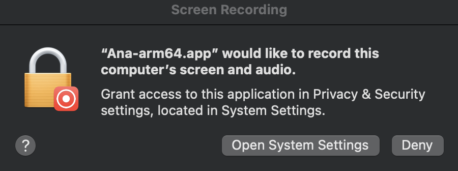
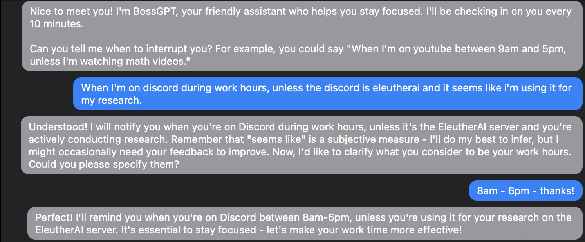
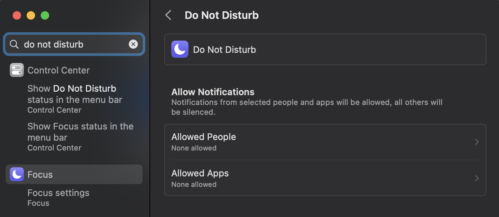
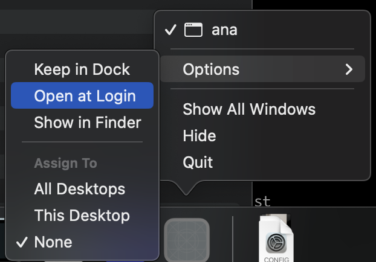

# BossGPT

_The AI that helps you achieve your goals._


Please join our [Discord](https://discord.gg/JQnNyAZeFk) and ask us for features!

## Installation instructions

Download the `.app.zip` release from the [releases](https://github.com/UlisseMini/bossgpt/releases) page, unzip it, right click and press "Open"

Allow screen recording permission (required for the AI to watch you!)



Then tell the AI when to interrupt you, for example:



And make sure to either disable D&D or add an exception for BossGPT! `System Settings > Do Not Disturb` and add an exception.



You can also set up open on login if you want!



After you configure that the AI will check in on you every 10 minutes. To test it, you can "fast-forward" by pressing option+command+c to trigger a check-in immediately on the currently visible windows.

If it doesn't work please open an issue or bug us on [discord](https://discord.gg/JQnNyAZeFk). I want to solve people's executive function problems!

## Motivation

I sometimes get distracted during work I have to get done. I've tried blocking stuff, but it's always easy to disable or not flexible enough for my exceptions, like allowing YouTube but only for educational content.

So I'm building an AI to watch over my shoulder and help me work. My dream setup is something like this:

```
A: Why are you on Youtube - Mark Rober?
U: I'm taking a break. Please poke me if I don't get back on task within 10 more minutes though
A: Okay!
(10 minutes later)
A: You're still on youtube! Is something stopping you from getting back on task?
U: Yeah I'm tired, I didn't sleep well last night
A: That's unfortunate to hear. Is there anything you prefer to watching youtube when tired?
U: Oh, I'd like to read the three body problem book, ideally outside so the fresh air helps with me being tired
A: You can do it! Want me to close youtube and lock the screen after this video?
U: Sure.
A: <Automatically locks screen when the video ends>
A: <Remembers relevant information about me and learns to suggest reading outside next time>
```

It isn't there yet. The current version just notifies you when you're on a time sink and tries to talk you into doing an endorsed activity, but I'm excited to improve this and help people solve their productivity problems :D

## Ideas

Some future directions I might go in. If you're interested in the project please let me know which is most exciting to you.

### Talk to past self

Basically, "talk to your past self" depending on the context. Do [this](https://platform.openai.com/docs/guides/gpt-best-practices/strategy-split-complex-tasks-into-simpler-subtasks) with activation based on current activity context.

Have N contexts, each has a name, data for detection (examples and/or instructions), and a prompt for handling that situation. When a context is activated an empty chat window opens with an indicator for the context, and the LLM talks to you based on the prompt.

Basically customer service where you're the company, user, and product.

### Advanced automatic time tracker

From window titles plus all the text on screen and AI you could build a great automatic time tracker. Some differentiating features:

- When you're away from the computer the AI asks what you did to fill in missing time
- The AI can help you reflect about how you spent your time
